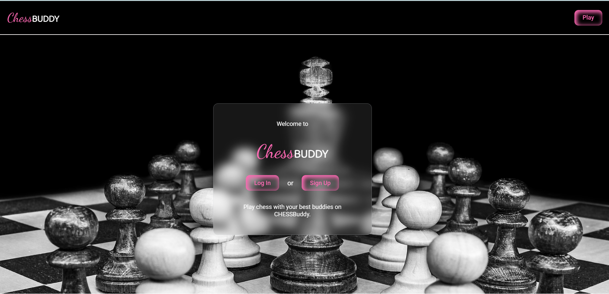

# Chess Multiplayer Game

Welcome to the Chess Multiplayer Game project! This is a real-time multiplayer chess game that allows you to play chess with your friends online. The project consists of both a frontend and a backend, providing a seamless and interactive gaming experience.



## Preview Video

Check out our [Preview Video](https://vimeo.com/855970301) to see the game in action!

## Getting Started

To get started with the game locally, follow these steps:

### Frontend

1. Navigate to the `frontend` directory using:

```cd frontend```

2. Install frontend dependencies:

```yarn```

3. Start the frontend app:

```yarn dev```

The frontend app will be accessible at http://127.0.0.1:5173/

### Backend

1. Create a `.env` file in the `backend` directory.

2. Set up the following environment variables in the `.env` file:

```JWT_SECRET_KEY=your_secret_key```

```MONGO_URI=your_mongodb_uri```

3. Navigate to the `backend` directory in a separate terminal:

```cd backend```


4. Install backend dependencies:

```yarn```


5. Start the backend server:

```yarn start```


The backend server will run at http://localhost:4000/.

## Contributing

We welcome contributions from the community! To contribute to the project:

1. Fork the repository.

2. Clone your forked repository:

```git@github.com:your-username/CHESS-Buddy.git```


3. Make your changes and improvements.

4. Commit and push your changes to your forked repository.

5. Create a pull request to the original repository. We'll review your changes and merge them if they meet the project's guidelines.

## Features

- Play chess in real-time with your friends.
- Interactive chessboard with valid move highlighting.
- Pawn promotion with underpromotion options.
- Castling and en passant move support.

## Technologies Used

- **Frontend:** React, Socket.IO, Chess.js
- **Backend:** Node.js, Express, MongoDB, Socket.IO

## Contact

For any questions or suggestions, feel free to contact us at tanuchahal0004@gamil.com.

Happy Coding! 🎉